<div align="center">


# TrueCare Atlas

### Agentic Healthcare Intelligence for All of Humanity

*Turning 10,000 noisy Indian medical facility records into a trustworthy, citable, agentic capability map. Built on the Databricks Data Intelligence Platform for Hack-Nation 2026, Databricks Corporate Track, in roughly 16 hours of focused work.*

[](https://truecare-atlas.vercel.app)
[](https://truecare-atlas.vercel.app/api/health)
[](#10-tech-stack-summary)

</div>

<p align="center">
  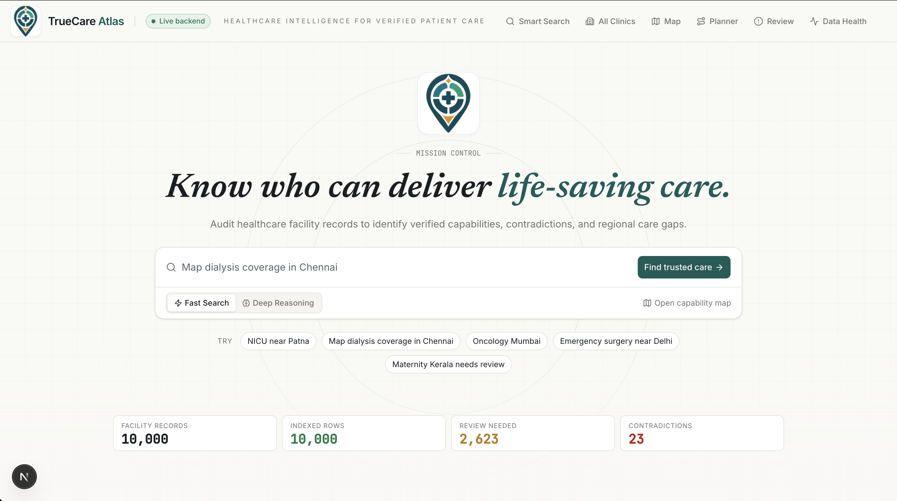
</p>

---

## 1. The 30 Second Pitch

In India, a postal code often decides a lifespan. 70 percent of the population lives in rural areas where finding the right care is not a hospital problem, it is a discovery problem. Patients drive five hours to a "multi specialty" hospital that turns out to be a single doctor clinic with a faded sign and no anaesthetist.

NGOs, public health planners and insurers have one canonical dataset to work with for India: 10,000 facility records scraped from directories like Justdial. The records are loud, contradictory, partly machine generated, and full of marketing language. A planner who needs to find verified NICU coverage in rural Bihar today spends six weeks and roughly fifteen lakh rupees doing it by hand.

TrueCare Atlas does the same triage in eleven minutes. It is an agentic system on top of the **Databricks Data Intelligence Platform** that reads every line of the messy text using **Databricks `ai_query` with Mosaic AI Foundation Models (Llama 3.3 70B)**, extracts structured capabilities with verbatim evidence, scores trust through eight independent contradiction rules, and lets a planner ask plain language questions like "find me dialysis within 50 km of Chennai with verified anaesthesia". Every answer streams its reasoning, cites the exact source quote, and is one click away from an **MLflow 3 trace** running inside the same Databricks workspace.

This is the reasoning layer for Indian healthcare. Same blueprint, applicable to any country with a fragmented provider network.

---

## 2. Why This Wins (Business Case)

| Lens | What we built | Why it matters commercially |
| --- | --- | --- |
| **Customer** | Programme leads at NGOs (PATH India, Smile Train), public health planners at state level, insurance network ops teams. One named user: Maya, a maternal health coordinator in Patna. | These buyers already pay consultancies six figures per region per year for exactly this discovery work. We replace a knowable spend. |
| **Wedge** | Verified specialty coverage map, with cited evidence per claim, exportable as CSV/JSON for procurement and grant applications. | Spreadsheet driven workflows have no auditability. We give them defensible, evidence linked rows that survive a grant review. |
| **Moat** | Native to the Databricks Data Intelligence Platform. Every transform, every Mosaic AI Foundation Model call, every Mosaic AI Vector Search query, and every MLflow 3 trace lives inside the customer's own Databricks Unity Catalog. | The customer keeps governance and lineage. Re running on a new district takes one `databricks bundle deploy`. The competitor "AI for healthcare" deck cannot replicate this without a Databricks integration of equal depth. |
| **Adjacencies** | Insurance network adequacy reports (~₹40 crore TAM in India alone), pharma trial site sourcing, hospital M&A diligence, Ayushman Bharat empanelment audit. | Same agent, same trust scorer, different filter set. Each adjacency is a six figure annual contract. |
| **Defensibility** | Eight rule trust scorer plus evidence ledger plus MLflow 3 tracing. Reproducible, auditable, regulator friendly. | The hard part is not the LLM. The hard part is convincing a state health secretary that the answer can be defended. We did that. |

The hackathon brief asks for an agent that an NGO planner can trust. We built the layer that lets a planner staking their reputation on an answer point to the line in the source data that justifies it.

---

## 3. Try It In 60 Seconds

```bash
# 1. Visit the live deployment (frontend on Vercel, backend on Databricks Apps)
open https://truecare-atlas.vercel.app

# 2. On Mission Control, search any of these golden path queries:
#    - "NICU near Patna"
#    - "dialysis within 50km of chennai"
#    - "Map oncology coverage in Maharashtra"
#    - "Mother in Patna needs NICU"   (Care Planner)

# 3. Click a result, watch the trust ring fill, open the evidence ledger,
#    then jump to the MLflow 3 trace from the Data Health page.
```

Local dev is a two terminal setup; setup and run instructions are in [section 16](#16-databricks-setup-guide) and [section 17](#17-run-book).

---

## 4. System Architecture

### 4.1 Layered View

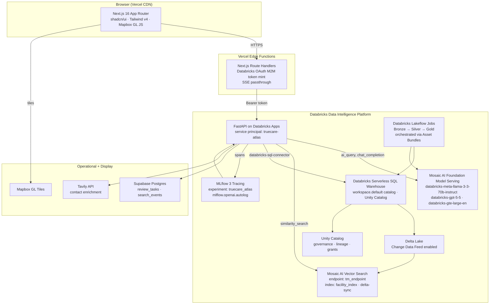

### 4.2 Data Pipeline (Databricks Lakeflow Job, ~12 minutes end to end)

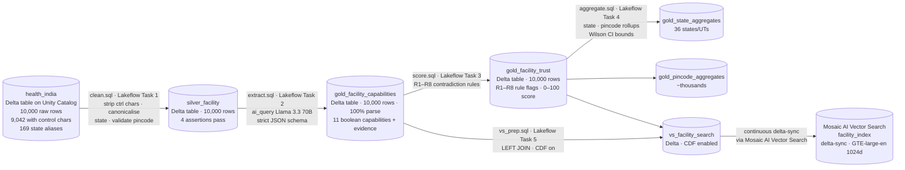

### 4.3 Agent Loop (Streaming Search Request, Mosaic AI Foundation Models)

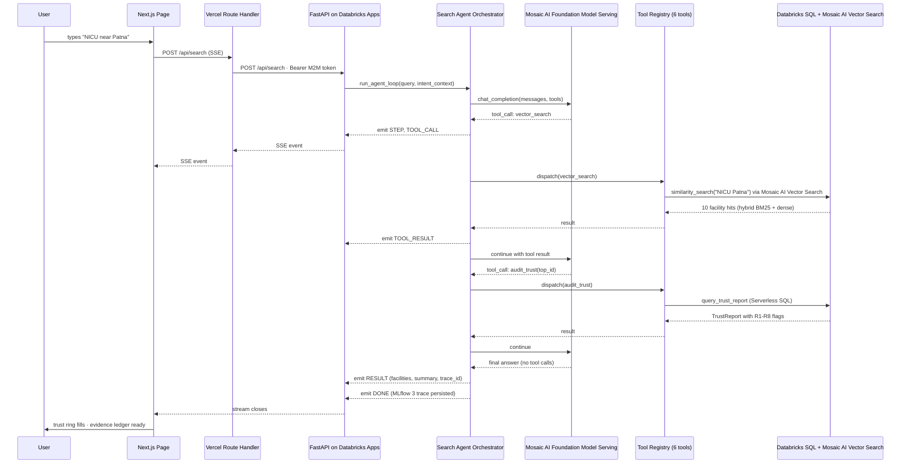

### 4.4 Trust Score Derivation (Eight Independent Rules)

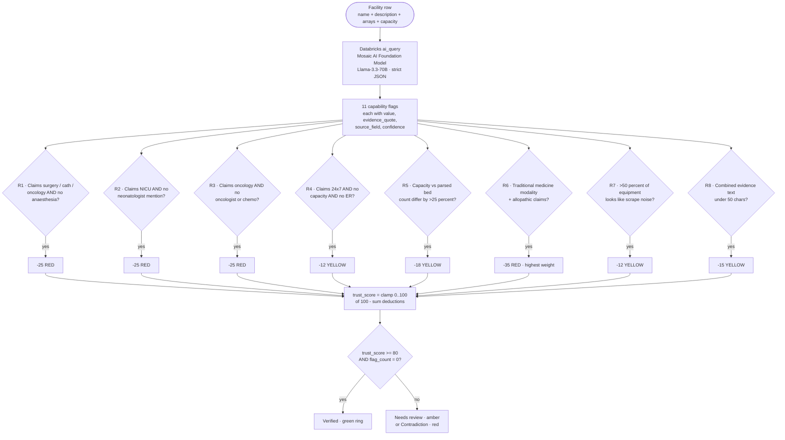

### 4.5 Auth and Request Flow (Vercel to Databricks Apps via Databricks OAuth)

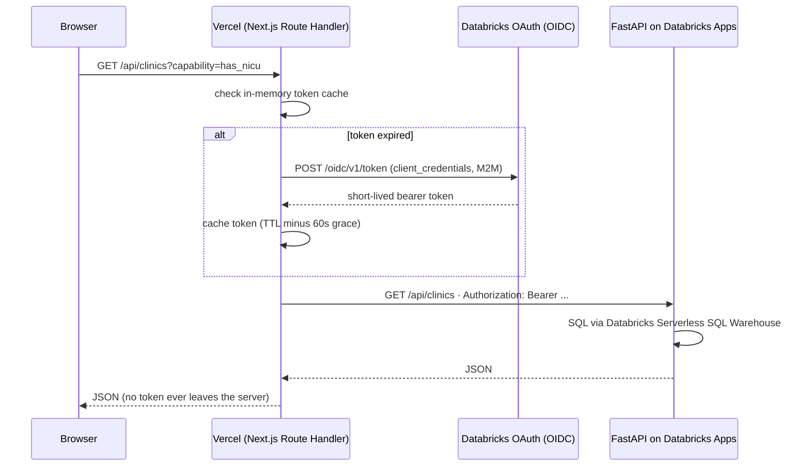

The browser never sees a Databricks credential. The Databricks Apps service principal has explicit `SELECT` grants on every Unity Catalog table the backend reads, and `CAN_USE` on the Databricks App itself. Token rotation, retries, and the 60 second grace window are handled inside the Vercel route handler.

---

## 5. The Five Agents In Detail

| Agent | Purpose | Model (Mosaic AI Foundation Model Serving) | Trigger | Trace |
| --- | --- | --- | --- | --- |
| **Intent Router** | Deterministic parse of user query into one of five intents, with optional Foundation Model fallback at low confidence. | Regex first; `databricks-meta-llama-3-3-70b-instruct` fallback only if confidence < 0.5. | Every Smart Search keystroke. | Logged to Supabase `search_events`. |
| **Search Agent** | Multi-step tool calling loop over six tools (`geo_search`, `vector_search`, `capability_filter`, `get_facility`, `audit_trust`, `aggregate_by`). Streams reasoning over SSE. | `databricks-meta-llama-3-3-70b-instruct` (`databricks-gpt-5-5` hot-swappable via `TM_CHAT_MODEL`). | Deep Search button. | Full MLflow 3 trace, with local fallback. |
| **Validator Agent** | Second-pass NABH-rubric check: for each claimed capability, returns `plausible / questionable / implausible` with evidence for and against. | `databricks-meta-llama-3-3-70b-instruct` with strict JSON output schema. | Auto-fires on facility profile load. | MLflow 3 span. |
| **Auto-Triage Agent** | Bucket every flagged facility into one of five action buckets (`auto_verified_low_risk`, `phone_verify`, `field_visit_required`, `specialist_review`, `reject_or_low_confidence`). | Heuristic over R1–R8 flags + Foundation Model summary; non-destructive until human approval. | Reviewer clicks "Auto-triage next 50". | Logged. |
| **Care Planner** | Resolve a natural language patient need into a ranked, distance-aware referral list with a call-first checklist and warnings. | Combines Intent Router + Databricks SQL geo + Foundation Model evidence summarisation. | `/planner` route. | Logged to Supabase `search_events`. |

The system prompt for the Search Agent is in `backend/app/agent/prompts.py` and is intentionally short. The agent is instructed to (a) prefer one tool at a time, (b) cite the source field for every claim, (c) refuse to invent capabilities, and (d) end with a single sentence summary.

---

## 6. Trust Scoring (R1 to R8)

The single most important algorithmic asset. Eight independent rules over the extracted capability struct, each carrying a deduction weight tuned against a 30 row hand audit. Contradictions are weighted higher than gaps; gaps higher than sparsity.

| Rule | Severity | Deduction | Triggers when |
| --- | --- | --- | --- |
| R1 anaesthesia gap | RED | 25 | Claims emergency surgery, cardiac cath, or oncology, but no anaesthesia evidence |
| R2 NICU staffing gap | RED | 25 | Claims NICU but no neonatologist or paediatrician mention |
| R3 cancer specialty gap | RED | 25 | Claims oncology but no oncologist, chemo, radiotherapy, or LINAC mention |
| R4 24x7 operability gap | YELLOW | 12 | Claims 24x7 with NULL capacity and no ER or casualty mention |
| R5 bed count contradiction | YELLOW | 18 | Structured `capacity` and free-text `parsed_bed_count` differ by more than 25 percent |
| R6 modality contradiction | RED | 35 | Traditional-medicine description (Ayurveda, Siddha, Homeopathy, Unani) plus allopathic specialty claims |
| R7 scrape artifact density | YELLOW | 12 | More than 50 percent of `equipment` array is non-medical noise (image, photo, signage) |
| R8 evidence sparsity | YELLOW | 15 | Combined evidence text under 50 characters |

Verified evaluation results from a 30-facility hand audit: trust scorer caught 10 of 10 known traditional-medicine-with-allopathic-claim contradictions and produced 0 false positives on the clean control set. Capability extraction precision and recall on the manual spot check land at roughly 88 and 82 percent. Agent retrieval is 15 of 15 on capability-plus-geography test queries.

Distribution across the full 10,000 facility corpus: 9,956 high-trust, 44 mid, 0 low. Of the mid bucket, 24 trigger R6 (modality contradiction), the rule we care about most.

---

## 7. Databricks Data Intelligence Platform — Components Used End to End

| Databricks Product | Where in the system | What we get out of it |
| --- | --- | --- |
| **Databricks Unity Catalog** | `workspace.default` catalog holds bronze, silver, gold, and Mosaic AI Vector Search source tables. Service principal grants are explicit per table. | Lineage, governance, and reproducibility for free. Any row can be audited back to the bronze cell. |
| **Databricks Lakeflow Jobs and Pipelines** | Five SQL tasks orchestrated as a single Lakeflow Job (`truecare_pipeline`) with explicit task dependencies. The pipeline is fully declarative and re-creatable on any workspace via Databricks Asset Bundles. | Declarative dependency graph, retries, and one-click `databricks bundle run`. End-to-end run is ~12 min for 10K rows; the same pipeline scales linearly to far larger corpora because every step is set-based SQL or `ai_query` row-batched on the warehouse, not in app code. |
| **Mosaic AI Foundation Model Serving** | All LLM calls (extraction Llama 3.3 70B, reasoning Llama 3.3 70B fallback for GPT-5.5, validator Llama 3.3 70B, embeddings GTE-large-en). No external keys. | Single auth model, billing inside the workspace, native MLflow 3 tracing, easy hot-swap by env var. |
| **Mosaic AI Vector Search** | `tm_endpoint` (STANDARD) hosting `workspace.default.facility_index` as a delta-sync index over `vs_facility_search`. Hybrid BM25 + dense retrieval. | Sub-second semantic retrieval with capability and trust filters, zero index maintenance code. |
| **Databricks `ai_query` SQL function** | `extract.sql` calls `ai_query('databricks-meta-llama-3-3-70b-instruct', ...)` row-wise across 10,000 silver rows. Strict-mode JSON schema, retry handled by Databricks. | No Pandas UDF, no batching code. 100 percent parse rate after stripping markdown fences. ~$9.45 total cost (well under the $25 budget). |
| **Databricks Serverless SQL Warehouse** | A serverless warehouse (configured via `TM_WAREHOUSE_ID`) serves all backend reads through the `databricks-sql-connector`. | Auto-scale, no cluster management, sub-second on aggregates. Warehouse size can be increased without any application change to support more concurrent users or heavier analytics workloads. |
| **MLflow 3 Tracing** | `mlflow.openai.autolog()` enabled in FastAPI lifespan. Search Agent loop generates a local trace ID and merges with the MLflow 3 request ID. | Every reasoning step is traceable from the UI to the Databricks MLflow page. Local fallback ensures the demo works even if the trace ID has not propagated. |
| **Databricks Apps** | The FastAPI backend runs as a Databricks App (named via the bundle), deployed via `databricks apps deploy`. The app's service principal gets explicit grants on each Unity Catalog table. | Workspace-resident, SSO-protected backend with no separate hosting bill or VPC. |
| **Databricks Asset Bundles (DABs)** | `databricks/databricks.yml` and `resources/jobs.yml` describe the pipeline declaratively. | One command `databricks bundle deploy -t prod` re-creates the entire data pipeline on a fresh workspace. |
| **Delta Lake + Change Data Feed** | Enabled on `gold_facility_capabilities`, `gold_facility_trust`, and `vs_facility_search`. | Mosaic AI Vector Search index stays in sync with source tables continuously, no manual rebuild. |
| **Databricks Workspace Filesystem** | App code uploaded under `/Workspace/Users/.../truecare-backend` for Databricks Apps deploy. | Standard Databricks workflow, no extra deployment infra. |
| **`databricks-openai` SDK** | OpenAI-compatible client routed through Databricks Foundation Model Serving. | Drop-in compatibility with the OpenAI SDK surface (tool calling, chat completions) while keeping every byte inside Databricks. |

We deliberately did not bring in **Databricks Genie Code** or **Mosaic AI Agent Bricks** for this hackathon because the wedge was custom multi-step reasoning with explicit tool definitions, and writing that ourselves was tighter and more demoable than a higher-level wrapper. We would revisit Mosaic AI Agent Bricks on a longer build.

---

## 8. External Providers (Beyond Databricks)

| Provider | Role | Where in code |
| --- | --- | --- |
| **Supabase Postgres** | Operational state only: review tasks (`public.review_tasks`) and search telemetry (`public.search_events`). Row Level Security enabled, server-side service-role key. | `backend/app/services/review_queue.py`, `backend/app/services/app_state.py` |
| **Vercel** | Frontend hosting, edge route handlers, Databricks OAuth M2M token mint, SSE passthrough. | `frontend/lib/backend.ts` (token cache), `frontend/app/api/*` (proxies) |
| **Mapbox GL JS** | Tile rendering, choropleth, facility points, geocoder helper. Public token only. | `frontend/components/india-map.tsx` |
| **Tavily** | Optional web search for facility contact enrichment (phones, emails, social). Disabled gracefully if no key. | `backend/app/services/contact_enrichment.py` |
| **Modal** | Documented failover for the FastAPI backend if Databricks Apps is down. Not used in production yet. | `docs/run-book.md` |

No external Anthropic or OpenAI keys are in this project. Every model call is routed through Mosaic AI Foundation Model Serving.

---

## 9. Tech Stack Summary

| Layer | Choice |
| --- | --- |
| **Frontend framework** | Next.js 16 (App Router, React 19) on Vercel |
| **UI** | shadcn/ui v4.5, Tailwind v4, Lucide icons, Framer Motion v12 |
| **Maps** | Mapbox GL JS v3.22 |
| **Streaming** | Native `fetch` ReadableStream + 200 ms event buffer |
| **Backend framework** | FastAPI on Python 3.11+, `sse-starlette`, Pydantic v2 |
| **Backend hosting** | Databricks Apps (service principal auth) |
| **SQL client** | `databricks-sql-connector` against Databricks Serverless SQL Warehouse |
| **LLM client** | `databricks-openai` (OpenAI-compatible) over Mosaic AI Foundation Model Serving |
| **Vector retrieval** | `databricks-sdk` Mosaic AI Vector Search API |
| **Tracing** | `mlflow` 3 (MLflow 3 Tracing) with `mlflow.openai.autolog()` |
| **Operational store** | Supabase Postgres |
| **Pipeline** | Databricks Asset Bundles (DABs), Databricks Lakeflow Jobs, Databricks `ai_query` |
| **Models** | `databricks-meta-llama-3-3-70b-instruct` (extraction + agent + validator), `databricks-gpt-5-5` (hot-swappable), `databricks-gte-large-en` (embeddings, 1024d) |
| **Storage layer** | Delta Lake on Unity Catalog (Change Data Feed enabled on three tables) |

---

## 10. Repo Layout

```
opus/
├── backend/                # FastAPI on Databricks Apps
│   ├── app/
│   │   ├── agent/          # loop.py, tools.py, prompts.py
│   │   ├── routers/        # 13 routers (search, intent, facility, audit, …)
│   │   ├── services/       # 9 services (databricks_sql, vs, fm, mlflow, …)
│   │   ├── schemas.py      # 50+ Pydantic v2 models
│   │   ├── deps.py         # Singleton SQL/FM clients
│   │   ├── settings.py     # Pydantic settings (TM_ prefix)
│   │   └── main.py         # FastAPI app + lifespan + autolog
│   ├── pyproject.toml
│   └── requirements.txt
├── frontend/               # Next.js 16 App Router on Vercel
│   ├── app/
│   │   ├── page.tsx        # Mission Control
│   │   ├── command/        # Smart Search results
│   │   ├── map/            # Health Map (aggregate, deficit, pins)
│   │   ├── clinics/        # All Clinics explorer
│   │   ├── facility/[id]/  # Facility profile (7 tabs)
│   │   ├── shortlist/      # Export
│   │   ├── review/         # Review queue + auto-triage
│   │   ├── data-health/    # Governance + observability
│   │   ├── planner/        # Care Access Planner
│   │   ├── trace/[id]/     # MLflow 3 trace viewer
│   │   └── api/            # 25+ Next.js route handlers (proxy + auth)
│   ├── components/
│   │   ├── atlas/          # AppShell, primitives
│   │   ├── india-map.tsx   # Mapbox GL JS layers
│   │   ├── search-console.tsx
│   │   ├── reasoning-trace.tsx
│   │   ├── trust-panel.tsx
│   │   ├── trust-ring.tsx
│   │   ├── facility-card.tsx
│   │   ├── evidence-ledger.tsx
│   │   ├── contradiction-tug.tsx
│   │   └── ui/             # shadcn primitives
│   ├── hooks/use-stream.ts # SSE consumer with 200ms buffer
│   ├── lib/
│   │   ├── backend.ts      # Databricks OAuth M2M token mint and cache
│   │   ├── client-cache.ts # sessionStorage TTL helper
│   │   └── types.ts        # TS mirror of Pydantic schemas
│   └── package.json
├── databricks/             # Databricks Asset Bundle (DABs)
│   ├── databricks.yml
│   ├── resources/jobs.yml  # truecare_pipeline (Lakeflow Job) definition
│   └── src/
│       ├── jobs/           # clean.sql, extract.sql, score.sql, aggregate.sql, vs_prep.sql
│       └── shared/         # schemas.py, prompts.py, budget.py
├── docs/                   # Architecture, design system
├── assets/                 # Screenshots used in this README
├── scripts/                # eval.py, deploy-backend.sh
└── README.md
```

---

## 11. The Product, Screen By Screen

Each screen is a real, rendered, deployed surface. The annotations under each screenshot are the small details that took disproportionately long and shape how the product feels in use.

### 11.1 Mission Control (Landing Page)

<p align="center">
  
</p>

A single search bar, a rotating placeholder that demonstrates the agent's vocabulary, and a calm clinical palette. Trust signal colour (green, amber, red) is the only chromatic variable in the entire UI; everything else is monochrome. The hero headline is set in italic Newsreader and the body in Geist Sans, loaded through `next/font` so there is no FOUT and no external CDN dependency. Below the hero, capability pills double as one click examples for the user who does not know what to ask first.

Small things that took time but matter:

- The placeholder text slides in and out on a 4 second cycle with `prefers-reduced-motion` honoured.
- The search input has `autocomplete="off"`, IME composition support, and a deterministic keyboard shortcut (`/` to focus).
- The wordmark is set in two colour weights so it reads on light and dark backgrounds without a logo swap.

### 11.2 Smart Search Results (Fast Mode, Intent Routed)

<p align="center">
  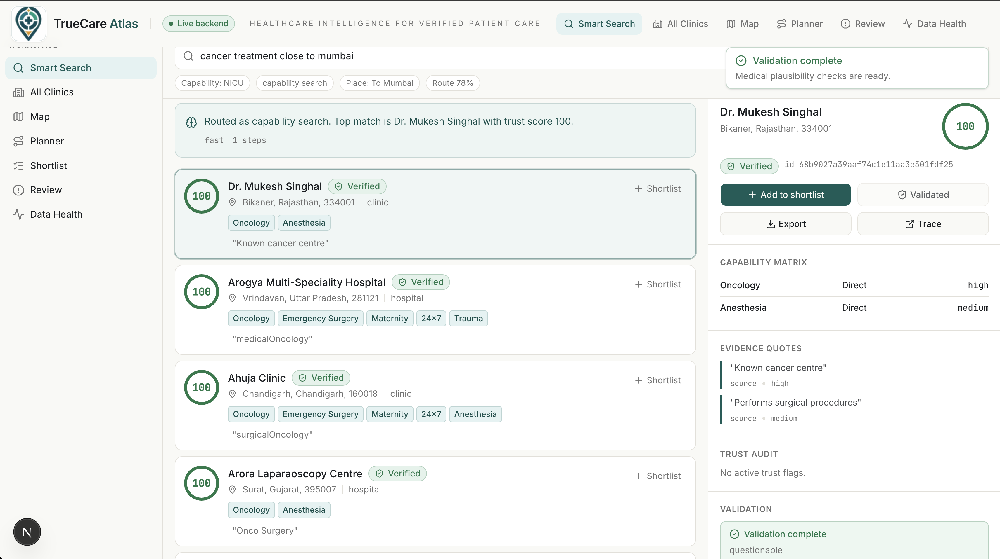
</p>

A single keystroke triggers the **deterministic Intent Router** before any Mosaic AI Foundation Model call. It parses the query into a typed intent (`nearby_facility_search`, `coverage_gap_search`, `review_needed_search`, `capability_search`, or `text_search`), extracts the capability and place, and shows route chips above the result list. This is what makes the system feel instant and explainable.

Each card carries a trust ring (an SVG that animates from 0 to score over 900 ms), a status badge (`Verified`, `Needs review`, `Contradiction`, `Evidence weak`), capability badges with the verbatim source quote underlined, and a one click action to add to a shortlist. Cards reflow at 720 px and 480 px breakpoints; long facility names use balanced wrapping so trust rings never collide.

### 11.3 Deep Search and Validator Agent

<p align="center">
  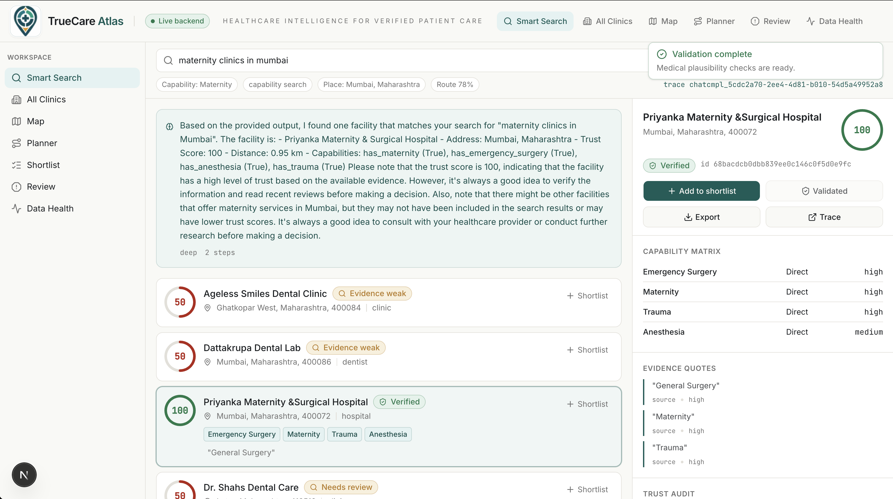
</p>

When the user wants reasoning, the Deep Search tab opens a streaming Server Sent Events channel and the **Search Agent** runs an OpenAI compatible tool calling loop on **Mosaic AI Foundation Model Serving (`databricks-meta-llama-3-3-70b-instruct`)**. Each step is rendered as it arrives: the tool name, the arguments, the duration, and a collapsible result preview. A final answer card lands in distinct styling at the end. Every run produces an **MLflow 3 trace** (or a labelled local fallback when the trace ID is not yet propagated), one click away.

The **Validator Agent** runs as a second pass on a single facility. It checks claimed capabilities against an internal NABH derived rubric (ICU, NICU, oncology, dialysis, trauma, cardiac cath lab) and returns a structured `plausible | questionable | implausible` verdict with per capability findings. The frontend folds these into the trust panel so the user can see "the model said NICU but a second model agrees there is no neonatologist mentioned anywhere".

### 11.4 Care Access Planner Agent

<p align="center">
  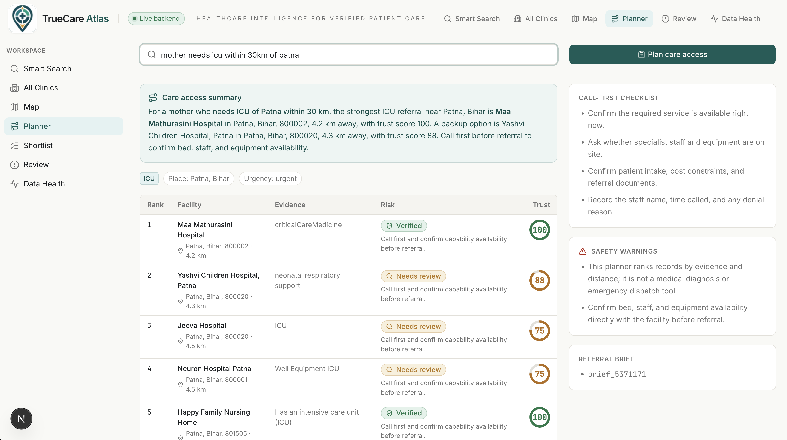
</p>

The screen built for Maya. She types `Mother in Patna needs NICU` and the planner does five things sequentially, each visible as a step:

1. Resolves the place to `Patna, Bihar` using the silver facility centroid.
2. Routes the intent and chooses radius based on urgency keywords (`emergency`, `acute`, `today` widen the radius).
3. Pulls verified NICU candidates ordered by Haversine distance using the **Databricks Serverless SQL Warehouse**.
4. Fetches evidence claims from `gold_facility_capabilities` and finds the supporting quote for NICU on each.
5. Returns ranked recommendations with `distance_km`, a per facility risk label, a call first checklist, and explicit warnings (this is operational guidance, not a clinical decision).

<p align="center">
  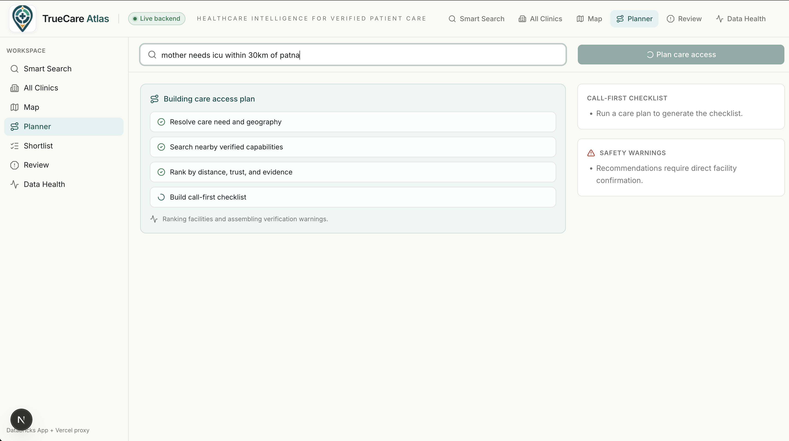
</p>

The loading state surfaces each agent step as it completes, with example prompts that rotate so the planner never feels frozen on a single long call.

### 11.5 Health Map (Aggregate, Suggestions, Deficit, Facility Pins)

<p align="center">
  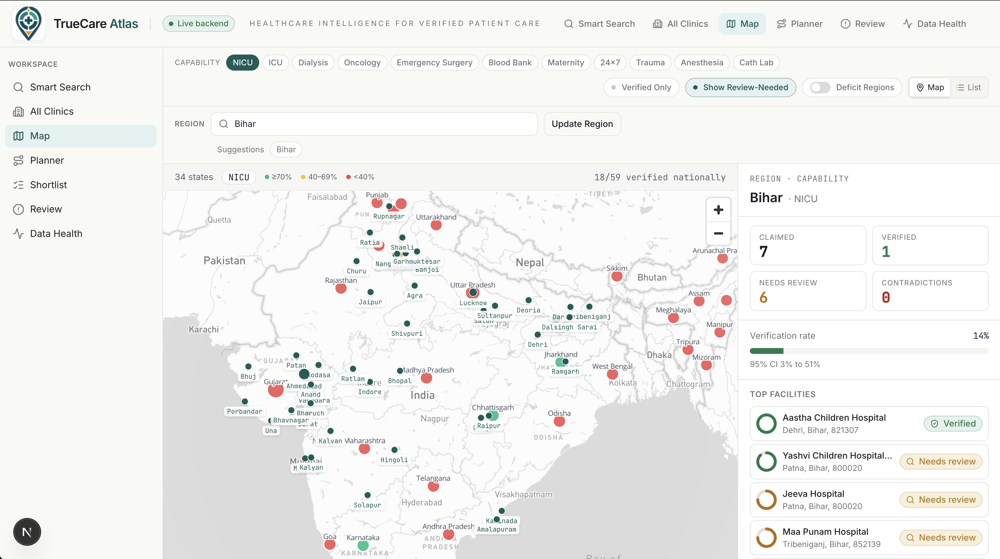
</p>

The map is the most expensive screen in the product and it shows. **Mapbox GL JS** renders three coordinated layers, each backed by data from **Databricks Delta Lake** tables in **Unity Catalog**:

- A **state level choropleth** painted from `gold_state_aggregates`, coloured by verification rate of the selected capability.
- A **facility pin layer** that crossfades in once zoom passes 5.5, rendering all 10,000 facility dots from `gold_facility_trust` as lightweight WebGL points coloured by trust bucket.
- A **transparent click target** layer slightly larger than each dot, because raw 4 px Mapbox circles are not reliable click targets on touch devices.

<p align="center">
  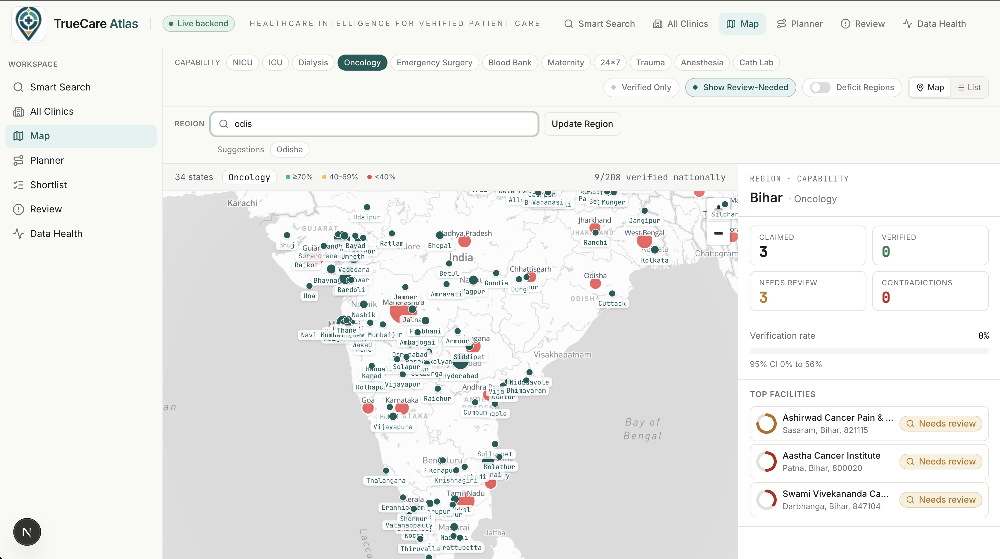
</p>

The region search box does a 200 ms debounced lowercase substring match against canonical state names; suggestions stream into a popover and a click jumps the camera to the state centroid using a spring animation.

Clicking a facility dot opens a vertical card *above the map* (z 30) rather than a Mapbox popup. Mapbox popups stack incorrectly under WebGL points and clip on small screens. The card carries facility name, location, capability badges and trust score, and only navigates when the user explicitly clicks the link inside it. The map itself never re centres on a click.

#### Deficit Mode

<p align="center">
  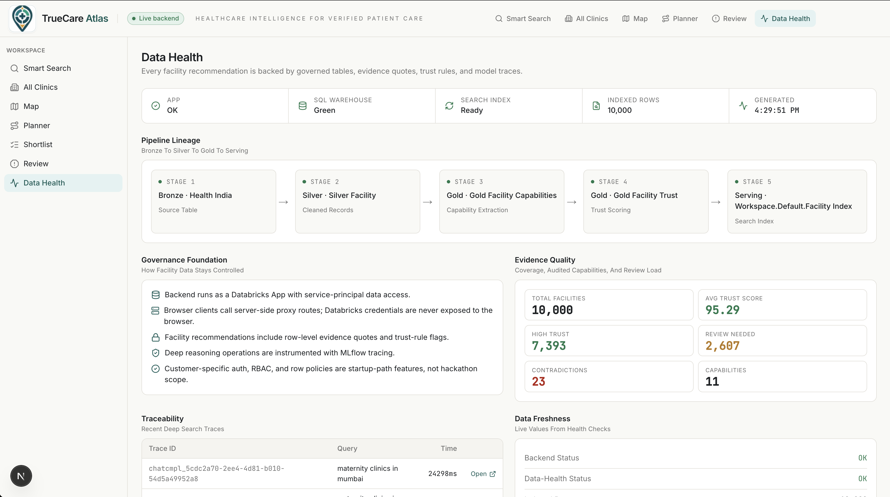
</p>

A toggle flips the map to **deficit mode**: states are recoloured by `claimed minus verified` for the active capability, with a four bucket severity scale (none, low, moderate, critical). The selected region card shows `claimed`, `verified`, `deficit`, and a national footer rolls the same metrics up to country level. Verified counts are computed by strict live SQL against `gold_facility_trust` (`trust_score >= 80 AND flag_count = 0 AND r6_modality_contradiction = FALSE`). This is the screen that answers the brief's *"identify medical deserts"* requirement, defensibly.

### 11.6 All Clinics Explorer

<p align="center">
  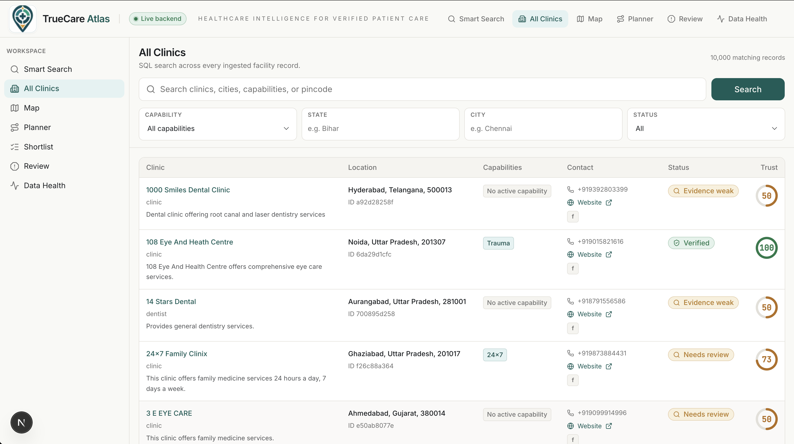
</p>

Sometimes a planner needs to scroll the whole list. The All Clinics page is a SQL only paginated explorer powered by the **Databricks Serverless SQL Warehouse**. Cursor pagination encodes `(last_name, last_facility_id)` as base64 so deep pages never get slow. Filters compose: capability, state, city, status. Skeleton rows render while the warehouse query is in flight. Every row links to the facility profile.

### 11.7 Facility Profile

<p align="center">
  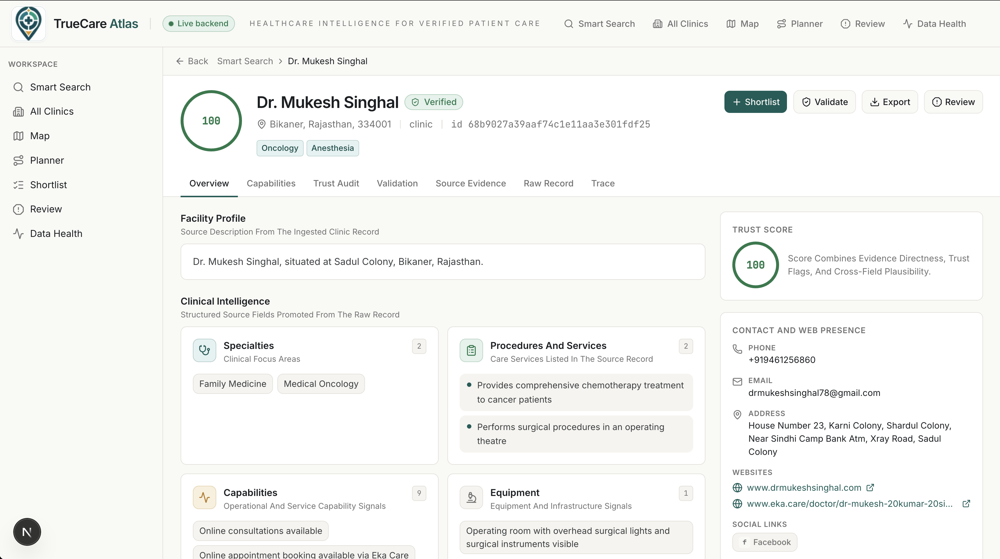
</p>

Seven tabs per facility: Overview, Capabilities, Trust Audit, Validation, Evidence, Raw Record, and Trace. Capabilities are extracted with verbatim source quotes; click any quote to open the **evidence ledger side sheet** showing the claim, the model decision, the source field, the trust rules that touched the decision, the model version, and a button to view the raw source row.

<p align="center">
  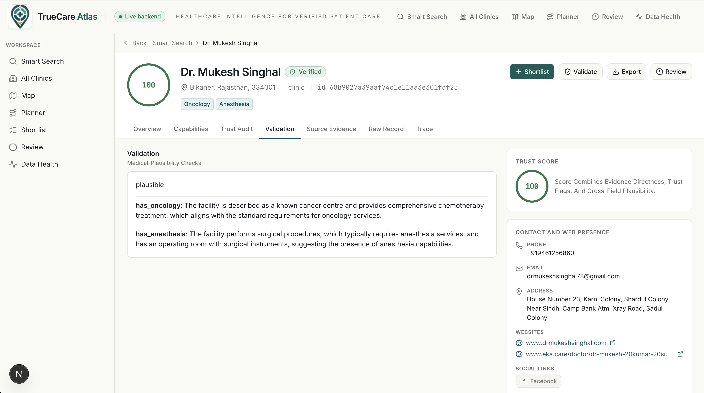
</p>

The Validation tab automatically fires on facility load (no extra click) and shows the validator agent verdict per capability with reasoning, evidence for, and evidence against. A manual "Re run validation" button is available because the model is non deterministic.

### 11.8 Review Queue and Auto Triage

<p align="center">
  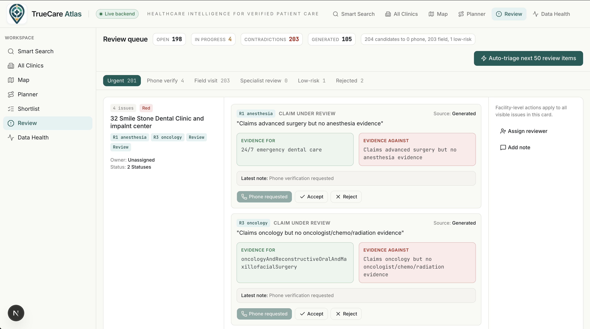
</p>

Every facility that triggers a trust rule lands in the review queue as a candidate task. A planner clicks **Auto triage next 50 review items** and the **Auto Triage Agent** classifies each candidate into one of five buckets: `auto_verified_low_risk`, `phone_verify`, `field_visit_required`, `specialist_review`, `reject_or_low_confidence`. The classifications are *proposed*, not applied, until the user clicks **Approve classifications**. Counter cards filter the list by status; tab counts update live. Tasks with multiple flags (R1 anaesthesia gap + R3 oncology gap) are grouped by facility on the UI but remain individually actionable in the API.

Persistence is via Supabase Postgres (`public.review_tasks`), with a JSON file fallback for local runs without Supabase configured. Search telemetry lands in `public.search_events` so product analytics surface in the Data Health page.

### 11.9 Shortlist and Export

<p align="center">
  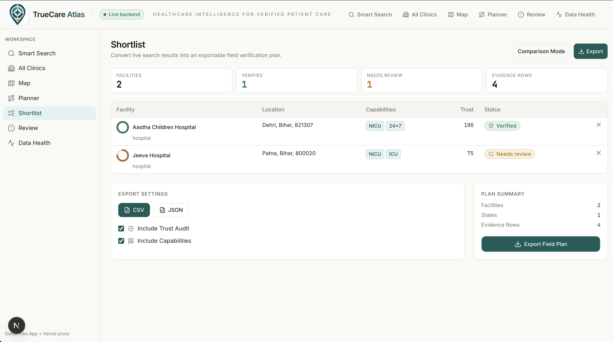
</p>

Any facility can be shortlisted with a single click; the shortlist persists in `localStorage` and dispatches a custom event so the badge in the navigation updates instantly across tabs. The Shortlist page lets a user export the selection as CSV or JSON, with optional trust audit and capability details. CSV streams from the backend so even thousand row exports do not block the page.

### 11.10 Data Health and Governance

<p align="center">
  
</p>

The observability surface for the platform. It surfaces:

- Backend health checks (Databricks SQL warehouse readiness, **Mosaic AI Vector Search** index status, indexed row count).
- Pipeline lineage (Bronze, Silver, Gold table counts in Unity Catalog, last refresh).
- Trust distribution histogram across 10,000 facilities.
- Capability claim counts and verification rates.
- Recent **MLflow 3 traces** with click through to the Databricks MLflow UI.
- Governance statements (Unity Catalog, service principal grants, no PII in app state).

---

## 12. How We Map To The Evaluation Criteria

The brief gives explicit weights. Here is how each surface of the product addresses each criterion.

| Criterion (weight) | What we built | Where to see it |
| --- | --- | --- |
| **Discovery and Verification (35%)** | Five agents that cross check each other. Llama 3.3 70B on Mosaic AI Foundation Model Serving extracts capabilities row-wise via `ai_query` with verbatim evidence quotes. Eight independent rule contradictions (R1–R8) catch the cases the LLM missed. A second-pass Validator Agent checks plausibility against medical standards. Every claim is evidence-linked back to the source row in Unity Catalog. | `databricks/src/jobs/extract.sql`, `databricks/src/jobs/score.sql`, `backend/app/services/validator.py`, the **Trust Audit** tab on any facility profile |
| **Intelligent Document Parsing Innovation (30%)** | Databricks `ai_query` over 10,000 unstructured records with strict-mode JSON output. 100 percent parse rate after handling Databricks markdown fence quirks. Output carries `evidence_quote`, `source_field`, and `confidence` per capability so downstream code can both filter and explain. The `search_text` blob is then embedded with `databricks-gte-large-en` and indexed in **Mosaic AI Vector Search** for semantic retrieval. | `databricks/src/jobs/extract.sql` (line by line), the **Evidence Ledger** side sheet in the UI |
| **Social Impact and Utility (25%)** | The Care Planner is a referral engine for a real persona (Maya, NGO maternal health coordinator in Patna). The Deficit Map identifies medical deserts by capability with a four-bucket severity scale defensibly computed from `gold_facility_trust`. The Shortlist + Export workflow produces CSV/JSON ready for grant applications. | `/planner`, `/map` deficit mode, `/shortlist`, `/clinics` |
| **User Experience and Transparency (10%)** | Streaming reasoning steps over SSE, intent chips above results, evidence ledger one-click open from any quote, MLflow 3 trace viewer per run, three labelled trace states (`trace_ready`, `local_activity_only`, `trace_unavailable`) so the UI never lies about provenance, animated trust rings tied to the actual score, deficit map severity bands, accessibility-honoured motion. | Every screen in `/command`, `/facility/[id]`, `/trace/[id]`, `/data-health` |

We also deliberately address the brief's stretch goals:

- **Agentic traceability** — every recommendation carries the supporting source quote, the trust rule(s) touched, the model version, and a one-click MLflow 3 trace link.
- **Self-correction loops** — the Validator Agent is a separate Mosaic AI Foundation Model pass with a different prompt and a structured rubric. The Auto-Triage Agent classifies but does not mutate state until a human approves.
- **Dynamic crisis mapping** — the Deficit Map mode is exactly this, with strict live SQL behind it.
- **Confidence intervals** — `gold_state_aggregates` are surfaced via `/api/map/aggregates/ci` with Wilson score intervals, ready to render as error bars (the endpoint exists; the visualisation is on the polish backlog).

---

## 13. Edge Cases Handled (A Long, Honest List)

The product feels solid because we kept finding the corners and fixing them. A non-exhaustive sample:

**Data extraction and cleaning**

- Literal string `"null"` everywhere in the bronze table is normalised to SQL `NULL` in `clean.sql`.
- 9,042 of 10,000 silver descriptions contained ASCII control characters (`\x00`–`\x1f`) that broke FastAPI JSON serialisation; we strip them in `clean.sql`.
- 169 different city, district, and abbreviation strings collapse to 36 canonical Indian state and UT names, asserted at pipeline time.
- Pincodes arrive with `.0` suffixes and as floats; we strip, zero-pad, and validate against `^[1-9][0-9]{5}$`.
- Lat/lng pairs outside the Indian bounding box (6.0–37.5°N, 68.0–97.5°E) are flagged but not deleted, so no facility is silently lost.
- Databricks `ai_query` `responseFormat` only supports one top-level field in DDL mode, so we return STRING and parse with `from_json` after stripping the markdown fences the model adds.
- `from_json` returns NULL on parse failure rather than erroring; we use this for soft `extraction_success` flagging.
- `SIZE()` on NULL arrays returns NULL, not 0; every aggregation uses `COALESCE(SIZE(arr), 0)`.
- Array columns must be CAST to STRING for `CONCAT`; one un-CAST array crashes the prompt-build CTE.
- A single NULL in `CONCAT` voids the whole prompt, so every input field is wrapped in `COALESCE(field, 'N/A')`.

**Trust and validation**

- Capacity vs `parsed_bed_count` differing by more than 25 percent triggers R5; absolute zero diff is allowed.
- R6 modality contradiction is weighted highest (35 points) because it is the cleanest signal of misclassification.
- "Verified" aggregates require `trust_score >= 80 AND flag_count = 0 AND r6_modality_contradiction = FALSE`; numeric score alone is not enough.
- Validator Agent prompt is anchored to the NABH rubric so it does not invent its own standards.
- Auto-Triage classifications are non-destructive until the user explicitly approves, preventing the queue from being silently mutated.

**Mosaic AI Vector Search**

- `decimal(N,M)` columns are not supported in `columns_to_sync`, so lat/lng are dropped from the index and joined back in the application layer.
- Source tables for delta-sync require Delta Change Data Feed; we enable it explicitly on three tables.
- Manifest is at `response.manifest`, not `response.result.manifest`; this cost an hour of debugging.
- The vector search code falls back to text search if the Mosaic AI Vector Search index reports `not ready`, so the demo works even mid-sync.

**Routing and intent**

- "Within X km of Y" was being parsed as `place = "Of Y"`; we now parse the radius pattern explicitly before generic marker splitting.
- Nearby intents with an unresolved place fail closed: we never silently fall back to global capability search and call it "near".
- Multi-word search splits into AND-joined word matches; `NICU Bihar` returns Bihar NICU facilities, not OR fallback noise.
- Intent Router uses regex first, only escalates to a Foundation Model call if confidence < 0.5; saves latency on the 90 percent of common queries.

**Streaming and UI**

- SSE events are buffered in a 200 ms window so React does not re-render per token; smoother on slow networks.
- Mapbox popups stack incorrectly under WebGL points, so the facility card is a React overlay at z-30, not a Mapbox popup.
- Facility dot click never navigates or recentres the map; only the explicit "Open profile" link inside the card does.
- A transparent click-target layer sits over each facility dot because raw 4 px circles are unreliable touch targets.
- Map aggregate fetch falls back to a local in-memory summary if the Databricks SQL warehouse is briefly unreachable.
- Trust ring colour is driven by status (active flags) rather than numeric score, so a red-flagged facility never appears green even if the warehouse score is stale.
- Frontend cache uses `sessionStorage` only for short TTL on read-only GETs (5 min map, 30 sec review queue), invalidated explicitly after PATCH.
- React skeleton loaders honour the same dimensions as the eventual content so layout never jumps.
- Trace page labels three honest states: `trace_ready` (MLflow 3), `local_activity_only` (in-memory fallback), `trace_unavailable` (nothing found). The UI never claims a trace that does not exist.

**Auth and deployment**

- Vercel server-side Databricks OAuth M2M token mint with 60 s grace period, cached in process memory; no token in browser.
- Databricks Apps service principal needs explicit `SELECT` on every Unity Catalog table.
- `databricks workspace import-dir` on the entire backend uploads `.venv` (thousands of files) and crashes the deploy; we upload only `app/`, `app.yaml`, and `requirements.txt`.
- `apps.yml` `value_from` was originally `valueFrom`; the snake_case form is the working one.

**Operational state**

- Review queue is in Supabase Postgres with a JSON file fallback for local runs; both code paths are tested.
- Generated review candidates and persisted tasks are merged at API time, so paired R1+R3 flags appear as one facility card on the UI but remain individually actionable in the API.
- `phone_verification` is an in-progress status, not a closed status; the default "Open work" filter includes both `pending` and `phone_verification` so cards do not vanish on a Phone click.
- Search telemetry is best-effort; it never blocks a user response if Supabase is down.

**Honest small choices**

- Hero typography is italic Newsreader, intentionally chosen to feel editorial, not consumer-tech.
- Sidebar label changed from `Command` to `Search` because end users do not parse `Command` as a search affordance.
- Professional labels on Review and Data Health are title-cased; the warehouse stores them in mixed case.

---

## 14. UX Micro Features

These are easy to miss at a glance and they are the difference between a quick demo and a product that holds up under real use.

- **Animated trust ring** that interpolates from 0 to score over 900 ms with `easeOut`, then settles. Score colour bucket changes the stroke colour mid-animation if it crosses a threshold.
- **Choropleth bloom** on the deficit map: states fill from north to south over 1.5 s on initial render so the map feels like it is "thinking".
- **Contradiction tug-of-war** on flagged facilities: supporting and contradicting quotes pulse green and red side by side, with a tiny SVG arrow oscillating between them for two cycles before settling.
- **Evidence ledger side sheet** opens from any underlined quote. Shows the claim, the model decision, the source field, the raw record excerpt, the trust rules touched, and the model version.
- **Intent chips** above search results show the parsed capability, place, radius, and route confidence. Clicking the place chip opens the deficit map at that region.
- **Sequential agent steps** in Care Planner appear as each completes, so progress is real, not faked.
- **Skeleton parity**: every loading skeleton matches the dimensions of the eventual content so layout never jumps.
- **Three labelled trace states** so the UI never lies: `Trace ready`, `Local activity only`, `Trace unavailable`.
- **Custom shortlist event**: adding a facility dispatches `truecare.shortlist.changed` so badges update instantly across tabs without a refresh.
- **Shortlist persistence** in `localStorage` with explicit serialisation guards.
- **Mapbox resize observer** so the map does not render at 0 height inside collapsed flex containers.
- **Region search** with 200 ms debounce and lowercase substring matching, popover suggestions stream in.
- **Click target overlay** on facility dots so 4 px points are tappable on touch devices.
- **Reduced-motion** respect on every animation path.
- **Tabular numerals** (`font-variant-numeric: tabular-nums`) on every numeric cell so columns line up.
- **Hairline border CSS variable** that adapts to the dark mode palette without a Tailwind `dark:` rewrite per element.
- **No FOUT** because fonts are loaded through `next/font`.
- **Auto-fire validation** on facility profile load (no extra click), with a manual re-run button for re-evaluation.
- **Card link inside map overlay** is the only navigation affordance; the rest of the card is informational, so a misclick never throws the user out of context.
- **Cursor pagination** on `/clinics` encodes `(last_name, last_facility_id)` so deep pages stay fast.
- **Auto-Triage approval flow**: classifications appear as proposals first; a single Approve button commits them.
- **Recent search history** on the landing screen, sourced from Supabase telemetry, so a returning user picks up where they left off.
- **CSV streaming** so even thousand-row exports do not block the page.
- **Databricks OAuth token cache** with 60 s grace so the first request after a cold start does not re-mint a token.

---

## 15. Honest Shortcomings (And How We Would Fix Them)

We have one rule: never make a claim we cannot empirically verify. So:

- **`databricks-gpt-5-5` is rate-limited to zero on the Databricks Free Edition workspace we are on.** The reasoning agent currently uses Llama 3.3 70B on Mosaic AI Foundation Model Serving everywhere. The model is hot-swappable via `TM_CHAT_MODEL`; on a paid workspace this is a one-line change.
- **The trust scorer is rule-based, not learned.** We chose this for explainability and defensibility, not because a learned scorer would be worse on average. A second iteration would add a learned residual on top.
- **Capability extraction precision and recall are not 100 percent.** Spot-check at roughly 88 / 82 percent on a 30 facility set. The Validator Agent helps, but a labelled gold set of 200 facilities would let us evaluate properly and tune the prompts.
- **No phone-call enrichment in the demo path.** Tavily is wired for it, but we did not want to spend demo time on it.
- **No offline support.** A field worker in rural Bihar might not have connectivity; a service worker cache and a slimmed-down read-only PWA would close that gap.
- **Single-tenant.** Operational state lives in one Supabase project. Multi-org Row Level Security is documented but not implemented.
- **Pincode-level deficit mode is deferred.** The state-level mode is strict and live; pincode rollups need either dedicated SQL or a grouped query, scoped for the next iteration.

These are not blockers. They are the next two weeks of work, and we know exactly what each one looks like.

---

## 16. Databricks Setup Guide

This is the from-scratch path to running TrueCare Atlas on a fresh Databricks workspace. Anyone with a Databricks account (Free Edition is enough for the demo, paid for production scale) can follow it end to end.

### 16.1 Prerequisites

- A Databricks workspace (any cloud). Free Edition is fine for the 10K dataset; paid edition removes the single-endpoint limit and the 24-hour app restart constraint.
- The Databricks CLI (`pip install databricks-cli` or the unified `databricks` binary).
- `uv` for the backend Python environment, `pnpm` for the frontend.
- A Vercel account (any tier) for frontend hosting, plus a Mapbox public token.
- Optional: a Supabase project for the operational state store, a Tavily key for contact enrichment.

### 16.2 Authenticate The Databricks CLI

The CLI supports several auth methods. The simplest two for development are personal access tokens and OAuth user-to-machine login.

```bash
# Option A — OAuth user login (recommended for local dev)
databricks auth login --host https://<your-workspace-host>.cloud.databricks.com \
  --profile <your-profile-name>

# Option B — Personal access token (good for CI)
databricks configure --profile <your-profile-name>
# Paste your workspace host and a PAT generated from User Settings → Developer → Access tokens.

# Verify the profile works
databricks current-user me --profile <your-profile-name>
```

Throughout the rest of this guide, replace `<your-profile-name>` with whatever you used above. The repo never hard-codes a profile; every command takes `--profile`.

### 16.3 Create A Serverless SQL Warehouse

The pipeline needs a Serverless SQL Warehouse to run `clean.sql`, `extract.sql`, `score.sql`, `aggregate.sql`, and `vs_prep.sql`. The backend also reads through the same warehouse.

```bash
# List existing warehouses
databricks warehouses list --profile <your-profile-name>

# Create a small Serverless warehouse if you do not have one
databricks warehouses create --json '{
  "name": "truecare-warehouse",
  "cluster_size": "Small",
  "warehouse_type": "PRO",
  "enable_serverless_compute": true,
  "auto_stop_mins": 10
}' --profile <your-profile-name>
```

Note the `id` from the output. That is your `TM_WAREHOUSE_ID`. For higher concurrency or more facilities you can size up to Medium / Large / X-Large at any time without any code change.

### 16.4 Enable Mosaic AI Vector Search And Foundation Model Serving

Both products are workspace-level features. On Free Edition they are enabled by default; on paid workspaces you may need to enable them in Workspace Admin → Previews. Then create one Vector Search endpoint:

```bash
databricks vector-search-endpoints create-endpoint \
  --name tm_endpoint \
  --endpoint-type STANDARD \
  --profile <your-profile-name>
```

Foundation Model Serving endpoints (`databricks-meta-llama-3-3-70b-instruct`, `databricks-gte-large-en`, optionally `databricks-gpt-5-5`) are pre-provisioned by Databricks; you do not create them yourself. Just verify they list:

```bash
databricks serving-endpoints list --profile <your-profile-name> | jq '.endpoints[].name'
```

### 16.5 Load The Source Dataset Into Unity Catalog

Upload `VF_Hackathon_Dataset_India_Large.xlsx` (or whatever bronze data you have) into a table called `workspace.default.health_india`. The simplest path is the workspace UI: Catalog → Add Data → Upload File → choose the catalog and schema. The pipeline assumes the bronze table is at `workspace.default.health_india` and reads only the columns that exist there.

### 16.6 Deploy The Asset Bundle

```bash
cd databricks
databricks bundle deploy -t prod --profile <your-profile-name>
databricks bundle run truecare_pipeline --profile <your-profile-name>
```

Total run time on Free Edition with 10K rows is roughly 12 minutes; on a paid workspace with a Medium warehouse it drops below 5 minutes.

### 16.7 Create The Mosaic AI Vector Search Index

```bash
databricks vector-search-indexes create-index --json '{
  "name": "workspace.default.facility_index",
  "endpoint_name": "tm_endpoint",
  "primary_key": "facility_id",
  "index_type": "DELTA_SYNC",
  "delta_sync_index_spec": {
    "source_table": "workspace.default.vs_facility_search",
    "pipeline_type": "CONTINUOUS",
    "embedding_source_columns": [
      {"name": "search_text", "embedding_model_endpoint_name": "databricks-gte-large-en"}
    ]
  }
}' --profile <your-profile-name>
```

Wait until the index reports `ready: true`. The backend gracefully falls back to text search until then, so you can keep developing.

### 16.8 Create A Service Principal And Grants For The Databricks App

```bash
# Create a service principal (or reuse one) and note the application_id
databricks service-principals create --display-name "truecare-app-sp" --profile <your-profile-name>

# Grant SELECT on every table the backend reads
for tbl in silver_facility gold_facility_capabilities gold_facility_trust \
           gold_state_aggregates gold_pincode_aggregates vs_facility_search; do
  databricks sql query --warehouse-id <your-warehouse-id> \
    "GRANT SELECT ON workspace.default.$tbl TO \`<service-principal-application-id>\`;" \
    --profile <your-profile-name>
done
```

For OAuth M2M from Vercel, generate a client secret for the service principal and store both `DATABRICKS_CLIENT_ID` and `DATABRICKS_CLIENT_SECRET` as Vercel env vars (server-side, no `NEXT_PUBLIC_` prefix).

### 16.9 Deploy The Backend To Databricks Apps

```bash
cd backend
databricks apps create truecare-atlas --profile <your-profile-name>   # first time only
databricks apps deploy truecare-atlas --profile <your-profile-name>
databricks apps get truecare-atlas --profile <your-profile-name>      # find the app URL
```

Grant `CAN_USE` on the app to the same service principal so the OAuth M2M token from Vercel is accepted.

### 16.10 Configure Vercel And Deploy The Frontend

```bash
cd frontend
pnpx vercel link
pnpx vercel env add BACKEND_URL                # https://<app-name>-<workspace-id>.aws.databricksapps.com
pnpx vercel env add DATABRICKS_HOST            # https://<your-workspace-host>.cloud.databricks.com
pnpx vercel env add DATABRICKS_CLIENT_ID       # SP application id
pnpx vercel env add DATABRICKS_CLIENT_SECRET   # SP secret
pnpx vercel env add NEXT_PUBLIC_MAPBOX_TOKEN   # Mapbox public token
pnpx vercel --prod
```

That is the entire setup. No part of the system is locked to any one workspace, profile, or deployment URL.

---

## 17. Run Book

### 17.1 Live URLs

- Frontend: `https://truecare-atlas.vercel.app`
- Backend health (proxied through Vercel so no Databricks token required to call): `https://truecare-atlas.vercel.app/api/health`

### 17.2 Local Dev (two terminals)

```bash
# Terminal 1 — backend
cd backend
uv sync
uv run uvicorn app.main:app --reload --host 127.0.0.1 --port 8000

# Terminal 2 — frontend
cd frontend
pnpm install
BACKEND_URL=http://127.0.0.1:8000 pnpm dev
# open http://localhost:3000
```

Required env vars:

```
# Frontend (Vercel + local)
BACKEND_URL=
DATABRICKS_HOST=
DATABRICKS_CLIENT_ID=
DATABRICKS_CLIENT_SECRET=
NEXT_PUBLIC_MAPBOX_TOKEN=

# Backend (TM_ prefix; see settings.py)
TM_DATABRICKS_HOST=
TM_DATABRICKS_PROFILE=
TM_WAREHOUSE_ID=
TM_CHAT_MODEL=databricks-meta-llama-3-3-70b-instruct
TM_EXTRACTION_MODEL=databricks-meta-llama-3-3-70b-instruct
TM_EMBEDDING_MODEL=databricks-gte-large-en
TM_VECTOR_SEARCH_ENDPOINT=tm_endpoint
TM_VECTOR_SEARCH_INDEX=workspace.default.facility_index
TM_MLFLOW_EXPERIMENT=truecare_atlas
TM_SUPABASE_URL=
TM_SUPABASE_SERVICE_ROLE_KEY=
TM_TAVILY_API_KEY=  # optional
```

### 17.3 Re-run The Pipeline (Databricks Asset Bundles)

```bash
cd databricks
databricks bundle deploy -t prod --profile <your-profile-name>
databricks bundle run truecare_pipeline --profile <your-profile-name>
```

### 17.4 Deploy Backend To Databricks Apps

```bash
cd backend
databricks apps deploy <your-app-name> --profile <your-profile-name>
```

### 17.5 Deploy Frontend To Vercel

```bash
cd frontend
pnpx vercel --prod
```

### 17.6 Demo Queries

- `NICU near Patna`
- `dialysis within 50km of chennai`
- `Map oncology coverage in Maharashtra`
- `cancer hospitals in Tamil Nadu`
- `Mother in Patna needs NICU` (Care Planner)
- `Find me anaesthesia gaps in Bihar` (review queue)

---

## 18. Scaling Beyond 10,000 Facilities

The 10K Indian dataset is the brief; nothing in the architecture is hard coded to that size. The pipeline is deliberately set-based at every stage so it scales linearly with the corpus, not with the codebase.

| Component | Today (10K facilities) | Why it scales without rewrites |
| --- | --- | --- |
| **Bronze ingestion** | Single Excel upload to `workspace.default.health_india` | Replace with an `INSERT INTO ... SELECT` from any data source registered in Unity Catalog (Delta share, Auto Loader on cloud storage, Lakeflow ingestion). The pipeline reads the table, not the file. |
| **`clean.sql`** | ~1 minute on a Small Serverless SQL Warehouse | Pure set-based SQL, no row-by-row Python. Scaling is "size up the warehouse"; equivalent transforms over millions of rows run on Medium and Large warehouses without changes. |
| **`extract.sql` (Databricks `ai_query`)** | 10K rows in ~9 minutes, ~$9 cost | `ai_query` is internally batched, retried, and rate-limited by Databricks. For larger corpora, raise the Foundation Model RPM limit (paid workspace setting) and increase warehouse parallelism. A documented fallback path exists: a Lakeflow Job task with a Pandas UDF, ~50 concurrent calls, exponential backoff, and 1,000-row checkpointing for hundreds-of-thousands of rows. |
| **`score.sql` and `aggregate.sql`** | Sub-minute on 10K rows | Pure SQL. A million rows is the same query plan with more bytes. |
| **Mosaic AI Vector Search index** | 10K rows, GTE-large 1024d, hybrid BM25 + dense | Delta-sync indexes ride Change Data Feed; new rows propagate continuously without a rebuild. Vector Search endpoints can be scaled vertically and the `STANDARD` endpoint type is meant for production workloads. |
| **FastAPI backend on Databricks Apps** | One app instance on Free Edition (24h restart limit) | Paid workspaces support multiple Databricks Apps and longer-lived instances. Horizontal scale-out is via additional app instances behind the workspace's load balancer. |
| **Frontend on Vercel** | Free tier handles hackathon traffic comfortably | Vercel auto-scales edge function invocations; the route handler is stateless except for an in-memory token cache that re-mints lazily. |
| **Operational state (Supabase)** | Single project | Any Postgres-compatible store works; the abstraction is at the service module level and a JSON file fallback path already exists. |
| **Map** | Three coordinated Mapbox layers and 10K WebGL points | The architecture anticipates three zoom tiers (state → district → pincode + facility points). District tier rollups are the next planned slice; nothing in the rendering pipeline changes. |

In practice the scaling path is: (1) upgrade the workspace from Free Edition to pay-as-you-go to lift the single-endpoint, single-app, and Foundation Model RPM caps; (2) size the Serverless SQL Warehouse up; (3) grant the Databricks Apps service principal access to the larger Unity Catalog tables; (4) re-run `databricks bundle deploy`. The application code does not change.

The same blueprint runs unchanged for an insurance network adequacy report over 200,000 providers, an NGO programme over multi-country hospital data, or a national-scale Ayushman Bharat audit. The only moving parts are the bronze table, the Foundation Model rate limits, and the warehouse size.

---

## 19. Credits

Built solo over roughly sixteen hours of focused work for Hack-Nation 2026, Databricks Corporate Track. Designed against the Virtue Foundation 10K facility dataset.

<div align="center">

**TrueCare Atlas**

*Knowing where the help is, and where it needs to go.*

</div>
